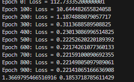
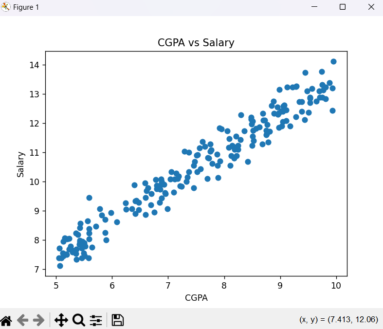
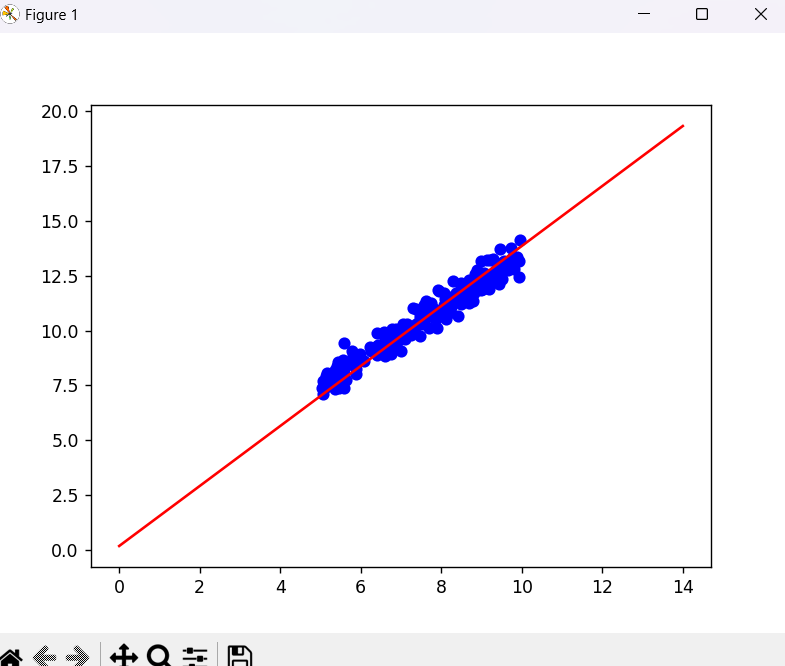

# theory 

mathematically 

consider you have a data student and student hour he study 

you plot it 

and want to find best line which is subjective 

to pass closest to it 

so line is y=mx+c only 

therefore first m and b/c value is random 

then we find loss function/cost function as of all 

majorly loss function tell the error 

e=1/n(summition(yreal-ypredicted)2)

mean square above 

now really to minimize this loss function we have to find best m and b for it hence we find partial differenciation of each m and b 
why??

differenction or gradient give the steepest point 

so if we opposite of it it will go down wards and gradient descent best and best value finding is near 

so m=m-learning rate*(diff)
also with b 

we loop it this is what linear regression is 

# maths

## 🧮 Hypothesis Function

In **Simple Linear Regression**, the prediction is made using a linear equation:
ŷ = m * x + b

Where:
- `ŷ` is the predicted value (e.g., salary)
- `x` is the input feature (e.g., CGPA)
- `m` is the slope (weight)
- `b` is the intercept (bias)

---

## 🎯 Loss Function - Mean Squared Error (MSE)

To measure how well our model performs, we use the **Mean Squared Error**:

MSE = (1/n) * Σ (yᵢ - ŷᵢ)²
= (1/n) * Σ (yᵢ - (m * xᵢ + b))²

Where:
- `yᵢ` is the actual value
- `ŷᵢ` is the predicted value
- `n` is the total number of data points

The goal is to minimize this error.

---

## 🔁 Gradient Descent - Optimization Algorithm

We minimize the loss by updating `m` and `b` using **Gradient Descent**.

Partial derivatives (gradients):

∂MSE/∂m = -(2/n) * Σ xᵢ * (yᵢ - (m * xᵢ + b))
∂MSE/∂b = -(2/n) * Σ (yᵢ - (m * xᵢ + b))

Update rules:

m = m - α * ∂MSE/∂m
b = b - α * ∂MSE/∂b

Where:
- `α` is the learning rate (controls step size)
- Gradients guide the parameters to reduce the loss

---

## ✅ Final Equation

After several iterations (epochs), the model learns the best-fit line:

ŷ = m * x + b

# CONCLUSION

we have used grad descent to found best subjective line matched to data given by magic of calculas and magic is understable using the concept of it you can see in maths in python we just used grad descent function and loss function to know epoche and know the error at each though we don't need to find it cause in grad descent we finding m,n value which later put into the plotting to give best line 

you can also see that epoche willl come to some constant value hence there was the point we stop 

## before 

## after 

